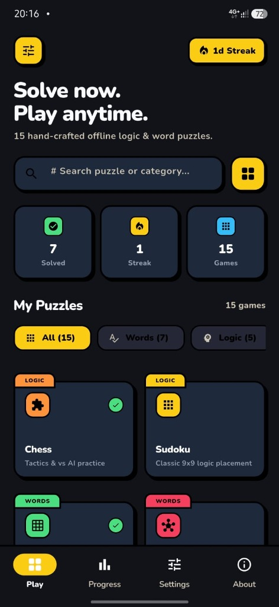
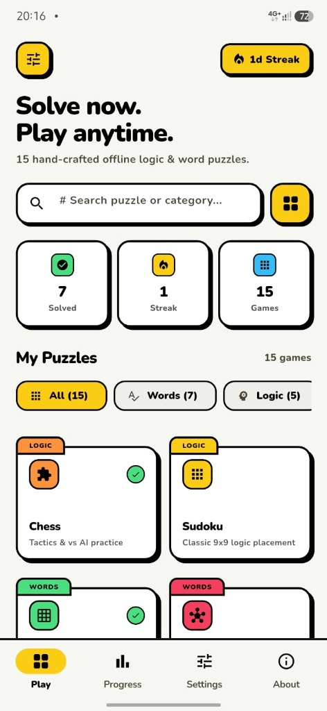

# Puzzlebox 🧩

A collection of **15 hand-crafted word and logic puzzle games** for Android, built with love by independent developer **[q04ti](https://q04ti.dev)**.

Everything is **100% free, offline, and ad-free**. No accounts, no subscriptions, no energy meters, and no microtransactions.

---

## 📲 Download for Android

* **[Download Latest APK (Universal)](https://github.com/Sinxn-coder/puzzlebox/releases/latest/download/puzzlebox.apk)** — Works on all Android devices
* **[Download ARM64 Lite APK](https://github.com/Sinxn-coder/puzzlebox/releases/latest/download/puzzlebox-arm64.apk)** — Optimized for modern 64-bit phones
* **[View All Releases](https://github.com/Sinxn-coder/puzzlebox/releases)**

---

## 📸 Screenshots

  
  &nbsp;&nbsp;&nbsp;&nbsp;
  

---

## 🎮 Included Games

1. **Chess** — Tactics puzzles, on-device AI opponent, and Pass & Play.
2. **Sudoku** — Classic 9x9 logic placement with notes and error feedback.
3. **Daily Five** — 5-letter word guessing challenge with position clues.
4. **Connections** — Group 16 words into 4 themed categories.
5. **Spelling Bee** — Find as many words as possible using the 7 letters.
6. **Mini Crossword** — Quick, fun daily grid crosswords.
7. **Strands** — Find themed word paths that fill the grid.
8. **Pips** — Solvable domino sum-matching puzzle.
9. **Tiles** — Pattern & color matching pair finder.
10. **Letter Boxed** — Connect side letters to form word chains.
11. **Vertex** — Connect dots to satisfy degree rules.
12. **Nonogram** — Picture logic grid puzzles.
13. **Binary** — Fill grids with 0s and 1s adhering to binary rules.
14. **Cages** — Latin square math puzzle grids.
15. **Word Search** — Classic word finder grid.

---

## 💡 Have an Idea or Game Suggestion?

Want to see a new puzzle game added to Puzzlebox, or have feedback to make the app even better?

👉 **[Submit a Suggestion on puzzlebox.q04ti.dev](https://puzzlebox.q04ti.dev)**

---

## 🔒 Privacy & Open Source

Puzzlebox respects your privacy:
* All game progress and stats stay stored locally on your device.
* No tracking, analytics, or background data collection.
* Read the full [Privacy Policy](https://puzzlebox.q04ti.dev/#privacy-policy).
